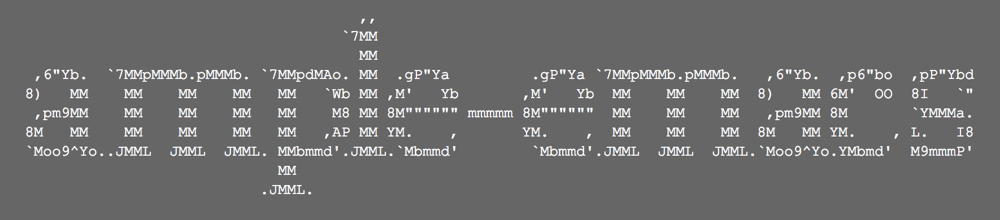

# ample-emacs

  

'Just enough' Emacs configuration with minimal external packages

## Setup

*ample-emacs* can be used in two ways.

### GitHub

Getting it from GitHub is easier of the two methods. You just need to clone the repository on your local workspace like:

    git clone https://github.com/myTerminal/ample-emacs.git

Then the only next step would be to make sure that [.emacs.d](.emacs.d) is at the root of your home directory.

You can either place it there manually or otherwise create a soft-link from its location to the home directory.

    ln -s </path/to/cloned/project>/ample-emacs/.emacs.d ~/.emacs.d

A clear advantage of the above method would be that you can pull updates from upstream with almost no effort.

Once done, start Emacs and get running within seconds.

### Docker Hub

*ample-emacs* is also available on Docker. To start it, run a command that looks like:

    docker pull myterminal/ample-emacs

## Features

### Highlights

- Minimal interface with almost everything except the window turned off
- The dark [wombat theme](https://github.com/jasonblewis/color-theme-wombat) applied by default, with a readable font-size
- *ido-mode* enabled to save you precious key-strokes at many places
- Navigation through buffers simplified with [winner](http://emacswiki.org/emacs/WinnerMode) and [windmove](http://emacswiki.org/emacs/WindMove).
- No more welcome screen, Emacs starts up to greet you and shows the date
- Only a few included standalone packages, with no dependency on external package archives
- Reload file in a buffer quickly with `<f5>`
- Some more configuration to improve usability

### Pre-configured packages

*ample-emacs* is designed to be minimalistic and hence just comes with the below pre-configured packages.

- [multiple-cursors](https://github.com/magnars/multiple-cursors.el) to allow spawning of multiple cursors to editing text that follows a particular pattern
- [which-key](https://github.com/justbur/emacs-which-key) to provide instant help around key-bindings as you press keys
- [ivy](https://github.com/abo-abo/swiper) (along with counsel and swiper) to make your experience with Emacs better

### Added key-bindings over stock Emacs

Refer [config-key-bindings.el](.emacs.d/ample-emacs/config-key-bindings.el) for all the pre-configured key-bindings for your convenience.

## Customizing

*ample-emacs* comprises entirely of plain-text Elisp files. Not everyone has the same setup and that means that you can (and may) change these files according to your need. However, if you're the kind of person who regularly pulls updates from upstream, there's a high probability that future improvements may end up resulting in merge conflicts on your local workspace. In order to solve this problem (and according to a suggestion from [@ericllazarus](https://github.com/ericllazarus)), the arrangement now has a redesign providing the user a way to extend their configuration without causing conflicts with future updates. One recommended way of extending *ample-emacs* is described below.

All configuration files under [.emacs.d/ample-emacs](.emacs.d/ample-emacs) with a name starting with `config-` can be extended by creating another file next to it with the same name but ending with a `-custom.el`. For example, if you plan to extend the file [config-packages.el](.emacs.d/ample-emacs/config-packages.el), you can create a file with the name `config-packages-custom.el` next to it in order to hold custom configuration. *ample-emacs* will load the original file first followed by the custom file (if it exists) in the right order as designed and you will achieve the effect you desire. Whenever there's an update to the original file, there will be no merge conflicts and life would be so much simpler!

## More

If you're looking for a configuration with super-powers, try [super-emacs](https://github.com/myTerminal/super-emacs).
